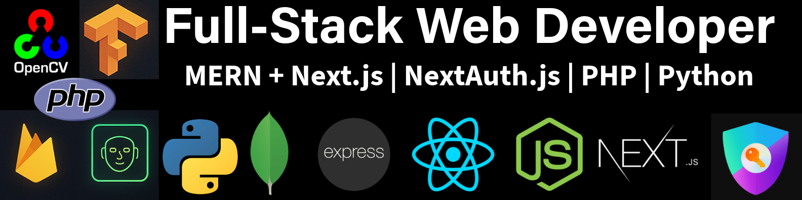

# 

# Hey 👋, I'm Amitesh Maurya  

**Full-Stack Developer (React, Next.js, Node, JavaScript) | Python | Face Recognition & Detection Researcher | AI/ML & Computer Vision | Technical Writer | Freelancer**  
*Turning ideas into impactful solutions with code & research.               
*Check out my portfolio: [Amitesh Portfolio](https://amiteshmaurya.com/) - built with Next.js, React, HTML5, CSS3, and JS (ES6+).

---

### 🚀 About Me 

I’m a **React & Next.js Developer** and **Computer Vision Researcher** passionate about building **scalable digital solutions** and advancing innovation in **AI/ML & Image Processing**.  
Currently, I’m developing a **Modular Face Detection Pipeline** leveraging **OpenCV, Dlib, MTCNN, and face_recognition** to enhance accuracy and real-time performance.  

Beyond development, I focus on **Digital Image Processing**, **AI/ML models**, and **image enhancement techniques**, contributing to **open-source projects** and publishing **research-driven solutions**.  

- 🔭 **Current Focus:** Building a modular **Face Detection Pipeline** (OpenCV, Dlib, MTCNN & face_recognition)  
- 📚 **Research Areas:** Digital Image Processing, Computer Vision, AI/ML, Image Enhancement & Edge Detection  
- 💻 **Developer Skills:**  
  - **Frontend:**     
  - **Backend:**     
  - **Databases:**     
  - **DevOps & Tools:**     
  - **Languages:**      
- ✍️ **Content Creation:** Writing about tech, research, and dev hacks  
- 🎯 **Goal:** Building scalable digital solutions & contributing to open-source  

---
 
### 📊 GitHub Stats & Activity  
  
  
  
  

---

### 🔥 Projects  
- **[Amitesh Portfolio](https://amiteshmaurya.com/)** → Next.js, React.js, HTML5, CSS3, JavaScript (ES6+)
- **[Amitesh Dev](https://amitesh.dev/)** → Next.js, React.js, HTML5, CSS3, JavaScript (ES6+)
- **[E-commerce](https://project1.amitesh.dev/)** →  ShopEasy - A Modern E-commerce Platform! SQLite with Prisma ORM
Authentication: NextAuth.js Next.js, React.js, HTML5, CSS3, JavaScript (ES6+) 
- **[Admission Management System Authentication](https://project2.amitesh.dev/)** →  Admission Management System Authentication: NextAuth.js Next.js, React.js, HTML5, CSS3, JavaScript (ES6+)
- **[Scientists Hub](https://scientistshub.com/)** → Knowledge-sharing platform for Science Articles  
- **[Scientists Hub Tools](https://tools.scientistshub.com/)** → Free online utilities for scientific & technical tasks  

---

### 🌍 Open Source Contributions  
- **[Face Detection Pipeline](https://github.com/amitesh-maurya/face-detection-pipeline)** → Modular detection with multiple backends & Gradio UI
- **[Face Recognition Pipeline](https://github.com/amitesh-maurya/face-recognition-pipeline)** → Modular Recognition with multiple backends & Gradio UI
---

### 📫 Connect With Me  
  
  

---

### 🐾 Visitors  

---

> *"Coffee + Code = Magic ☕✨"*  
